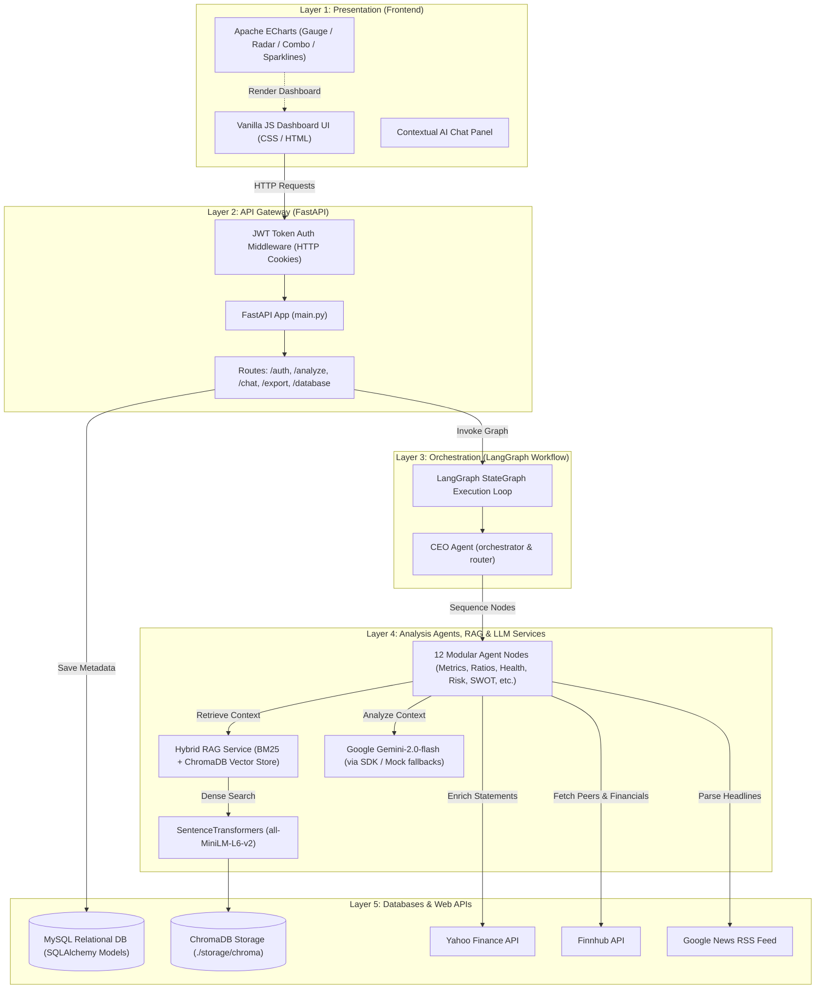
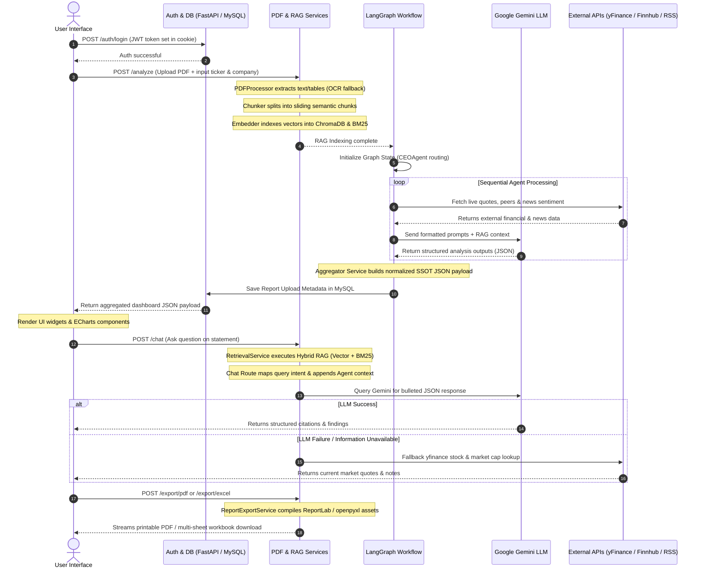

# Multi-Agent Financial Statement Analysis System

> **Academic-Grade | Production-Quality | Bloomberg-Inspired Terminal**  
> An autonomous AI investment research system powered by a 12-agent LangGraph workflow, hybrid lexical/semantic vector search (ChromaDB + BM25), real-time financial API integration (Yahoo Finance + Finnhub), and relational persistence (MySQL).

---

## Table of Contents
1. [Overview](#overview)
2. [Why This Project?](#why-this-project)
3. [Problem Statement](#problem-statement)
4. [Objectives](#objectives)
5. [Key Features](#key-features)
6. [System Architecture](#system-architecture)
7. [End-to-End Workflow](#end-to-end-workflow)
8. [Multi-Agent Workflow](#multi-agent-workflow)
9. [Hybrid RAG Pipeline](#hybrid-rag-pipeline)
10. [Financial Analysis & Recommendation Engine](#financial-analysis--recommendation-engine)
11. [AI Q&A Assistant](#ai-qa-assistant)
12. [Database Schema & Integration](#database-schema--integration)
13. [External APIs & Supplemental Services](#external-apis--supplemental-services)
14. [Technology Stack](#technology-stack)
15. [Project Structure](#project-structure)
16. [Quick Start & Setup Guide](#quick-start--setup-guide)
17. [Running Standalone Demos](#running-standalone-demos)
18. [Running Tests](#running-tests)
19. [Code Quality & Linting](#code-quality--linting)
20. [License & Usage](#license--usage)

---

## Overview

The **Multi-Agent Financial Statement Analysis System** is a research-grade investment platform designed to ingest corporate annual reports (PDFs), automatically extract and index financial tables and narratives, enrich the parsed data with real-time market data from web APIs, and orchestrate a multi-agent analysis workflow. The final output is aggregated into a Single Source of Truth (SSOT) JSON payload which feeds a Bloomberg-inspired dark-mode interactive dashboard.

---

## Why This Project?

1. **Automation of Investment Research**: Traditional financial statement analysis requires manual data entry from PDF annual reports into Excel spreadsheets. This system automates the ingestion, extraction, and formatting of financial data in seconds.
2. **Objective Recommendation Synthesis**: By combining programmatic margin/leverage math with qualitative LLM reasoning, the system generates unbiased, multi-factor investment ratings (BUY, HOLD, SELL) and computes target valuations.
3. **Auditability & Traceability**: Unlike basic LLM wrappers, every figure shown on the dashboard is linked back to specific PDF source pages via a hybrid semantic and lexical retrieval database (RAG).
4. **Structured Institutional Exports**: Investment managers can download the synthesized dashboard data instantly as print-ready PDF reports or highly structured, multi-sheet Excel workbooks.

---

## Problem Statement

Modern financial analysis is bottlenecked by the unstructured nature of corporate filings (10-K, 10-Q). Ingesting these documents, resolving accounting metrics across international boundaries (US GAAP vs. Indian GAAP), calculating key performance ratios, running peer comparisons, and checking live market sentiment requires hours of manual labor. Basic LLM solutions fail in this domain due to:
- **Hallucinations** in numerical metrics and formulas.
- **Context window limits** when uploading large annual reports (100+ pages).
- **Lack of grounding** in live market data, stock prices, and recent corporate news.

---

## Objectives

- **Accurate Ingestion**: Parse native and scanned financial reports using double-layered extraction (PyMuPDF + Tesseract OCR).
- **Zero-Conflict Representation**: Normalize accounting terminology using a canonical metrics schema (`CanonicalFinancialModel`) to ensure consistency across charts, tables, and PDF/Excel exports.
- **Autonomous Orchestration**: Design a modular 12-agent graph workflow (`LangGraph`) to divide and conquer financial metrics, health, risk, competitors, sentiment, and SWOT analyses.
- **Contextual Q&A**: Provide a RAG-grounded AI chat interface with query-specific intent routing and yfinance fallback support.
- **Relational Persistence**: Authenticate users via JWT and track upload reports and metadata in MySQL.

---

## Key Features

- **Ingestion & Extraction**: Extract text and tables from PDFs with scanned page Tesseract OCR fallback.
- **Hybrid Search RAG**: Dense vector search (ChromaDB + SentenceTransformers) fused with sparse lexical search (BM25) to retrieve PDF passages.
- **12-Agent LangGraph Workflow**: Multi-agent state orchestration starting with `CEOAgent` validation, passing through domain agents (metrics, ratios, health, risk, news, peers, SWOT, recommendation), and ending with an executive narrative.
- **Interactive Terminal Dashboard**: Sleek, dark-mode terminal layout featuring ECharts gauges, radar breakouts, combo bar/line performance trends, and CSS risk progress bars.
- **AI Q&A Assistant Sidebar**: Specialized chat panel with intent routing, bold metric highlight rules, and automatic Yahoo Finance live market data fallback.
- **Relational DB Logging**: Secure JWT login/signup with SQLAlchemy schemas tracking user report uploads in MySQL.
- **Dynamic Exports**: 1-click download of dashboard data as professional PDF briefs (ReportLab) or 12-sheet structured Excel workbooks (openpyxl).

---

## System Architecture



---

## End-to-End Workflow



---

## Multi-Agent Workflow

The workflow utilizes 12 distinct agents inside the LangGraph compilation sequence. Every agent is defined by a modular class (`agent.py`) located under its corresponding folder in `backend/agents/`.

| Agent | Purpose | Input State | Processing Logic | Output State | Context Source | Technologies |
|---|---|---|---|---|---|---|
| **CEO Agent** | Routes workflow and validates session states. | `session_id`, `ticker`, `company_name` | Validates ticker formatting and document paths. Initializes graph state structures. | `session`, `error` status | Session parameters | LangGraph `StateGraph`, Pydantic |
| **Company Detection** | Automatically detects target company identity. | Raw PDF text | Scans headers against known registries (Apple, Tesla, Microsoft, etc.) and extracts fiscal year via regex. | `company_name`, `ticker`, `fiscal_year` | Extracted PDF headers | Regular expressions, Pydantic |
| **Financial Parser** | High-precision statement parser. | PDF pages & tables | Maps extracted statement rows against standard aliases (e.g. US/Indian GAAP) using `METRIC_ALIASES`. | Extracted raw financial statements | PDF tables & text | PyMuPDF, regular expressions |
| **Financial Metrics** | Normalizes financial statement figures. | Upstream parsed statements | Integrates parsed PDF data with historical values from APIs. Resolves units and currency. | `historical_metrics`, `latest_metrics` | Upstream outputs, `yfinance`, `finnhub` | `yfinance`, Pydantic |
| **Financial Ratios** | Computes key margins, liquidity & leverage metrics. | Normalized metrics | Mathematically calculates ROE, ROA, current ratios, EBITDA margins, and interest coverage. | `historical_ratios` by year | Normalized metrics | Programmatic math, Pydantic |
| **Financial Health** | Evaluates financial health in 5 dimensions. | Metrics & ratios | Maps ratios programmatically to score indicators (0-100); passes variables to Gemini for qualitative analysis. | `health_breakdown`, `overall_health` | Upstream metrics & ratios | Custom scoring, Gemini API |
| **Risk Analysis** | Evaluates business risks in 5 dimensions. | Health scores, metrics | Inverts health scores (100 - health) to compute risk scores; queries Gemini to draft risk summaries. | `risk` indicators & narrative | Upstream health, Gemini | Custom scoring, Gemini API |
| **Market News** | Analyzes recent headlines & sentiment. | Company name, ticker | Scrapes Google News RSS; filters out future-dated articles; calls Gemini for sentiment score (0-100). | `news` articles list & sentiment | Google News RSS feed | XML parsers, Gemini API |
| **Competitor** | Conducts sector peer benchmarking. | Target company data, sector | Resolves peer tickers; fetches live yfinance financials; computes rankings and sector averages. | `competitors` statistics, narrative | Upstream metrics, Yahoo Finance | `yfinance`, Gemini API |
| **SWOT Agent** | Synthesizes target company SWOT quadrants. | All upstream agent outputs | Merges financial, risk, and sentiment details to query Gemini for Strengths, Weaknesses, Opportunities, Threats. | `swot` quadrant details | All upstream metrics | Gemini API, Pydantic |
| **Investment Rec** | Computes final investment rating. | Upstream scores & SWOT | Computes recommendation score (`health_score - 0.5 * risk_score`) and queries Gemini for action rationale. | BUY/HOLD/SELL verdict, target price | Upstream ratings, Gemini | Weighted score logic, Gemini |
| **Executive Summary** | Writes narrative executive summary. | Preceding agent outputs | Synthesizes all preceding insights into a structured, three-paragraph brief. | Consolidated dashboard summary | All upstream summaries | Gemini API, Pydantic |

---

## Hybrid RAG Pipeline

The RAG pipeline is implemented under `backend/rag/` and `backend/vectorstore/` to ensure zero-hallucination Q&A and text analysis.

1. **PDF Ingestion & Extraction** (`backend/services/pdf/pdf_processor.py`):
   - Opens PDF reports via PyMuPDF (fitz) to extract native text and tables page-by-page.
   - If a page contains images but no text, automatically falls back to scanned OCR mode using Tesseract OCR (`pytesseract` + `Pillow`).
2. **Chunking Strategy** (`backend/rag/chunker.py`):
   - Implements a semantic sliding-window text chunker (typically 500-1000 characters with 100-200 character overlap).
   - Detects financial tables and preserves row-column formatting as individual blocks to prevent structural fragmentation.
3. **Dense Embeddings** (`backend/rag/embedder.py`):
   - Computes 384-dimensional dense vector embeddings using the HuggingFace `sentence-transformers/all-MiniLM-L6-v2` model.
4. **Vector Storage** (`backend/vectorstore/chroma.py`):
   - Stores dense vectors and page metadata in a local ChromaDB collection (`./storage/chroma_db`).
5. **Sparse Lexical Retrieval** (`backend/rag/retriever.py`):
   - Builds a BM25 index on-the-fly (`rank-bm25`) containing all document chunks.
6. **Hybrid Retrieval & Score Fusion**:
   - Given a query, retrieves the top 10 chunks from ChromaDB (dense semantic similarity) and top 10 chunks from BM25 (exact keyword match).
   - Applies Reciprocal Rank Fusion (RRF) to combine results, ranking chunks based on their relative positions in both sets.
7. **Prompt Construction & Generation**:
   - The top ranked RAG chunks are formatted as a context block and appended to the agent's prompt template.
   - Pydantic models guarantee the LLM outputs strict JSON matching the schema requirements.

---

## Financial Analysis & Recommendation Engine

The system features a multi-layered financial evaluation framework that avoids basic text summarization:

```
[Financial Parser] ──► Extracts raw statements from PDF text and tables
        │
        ▼
[Financial Metrics] ─► Normalizes figures into Canonical Model (SSOT)
        │
        ▼
[Financial Ratios] ──► Programmatically calculates margins, returns, liquidity & leverage
        │
        ├──────────────────────┬──────────────────────┐
        ▼                      ▼                      ▼
[Health Evaluator]     [Risk Evaluator]       [Competitor Benchmarking]
Linear scoring (0-100)  Inverts health scores  Retrieves live peer quotes &
for 5 health aspects   for 5 risk aspects     calculates peer ranks (1 to 5)
        │                      │                      │
        └──────────────────────┼──────────────────────┘
                               ▼
                [Investment Recommendation]
                Weighted Score = (Profitability * 0.20) + (Growth * 0.20) + 
                                 (Liquidity * 0.15) + (Leverage * 0.15) + 
                                 (Cash Flow * 0.15) + (Risk_Score * 0.10) + 
                                 (Sentiment * 0.05)
                Verdicts:
                - >= 80: STRONG BUY
                - >= 65: BUY
                - >= 50: HOLD
                - >= 35: SELL
                - < 35: STRONG SELL
```

---

## AI Q&A Assistant

The contextual AI Q&A engine (`backend/api/routes/chat.py`) enables real-time inquiries about the uploaded PDF reports:

- **Intent Routing**: Classifies incoming queries into specific intents: `Metrics`, `Ratios`, `Health`, `Risk`, `Competitor`, `SWOT`, `Recommendation`, `Summary`, or `News`.
- **Dynamic Context Injection**: Based on the detected intent, it extracts only the relevant agent outputs from the graph state and appends them to the RAG context.
- **Strict Formatting Rules**: Prompts the Gemini model to respond in JSON containing:
  - `title`: Short descriptive headline.
  - `explanation`: Exactly 4-5 bullet points (each starting with `•` and containing 15-25 words) with key figures bolded.
  - `evidence`: Page numbers from which the facts were retrieved.
  - `confidence`: High, Medium, or Low rating.
- **Yahoo Finance Fallback**: If the query requests info that is not present in the PDF report, or if Gemini reports it is unavailable, the route falls back to `yfinance` to retrieve current stock prices, market cap, and valuation ratios.

---

## Database Schema & Integration

The relational storage layer is managed by SQLAlchemy (`backend/database/`):

- **Database Engine**: Relational MySQL.
- **Auth Layer**: Token-based JWT cookies authentication. User passwords are encrypted using `bcrypt` before storage.
- **SQLAlchemy Schemas**:
  - `users` table:
    - `id` (INT, Primary Key, Auto-Increment)
    - `name` (VARCHAR, Not Null)
    - `email` (VARCHAR, Unique, Not Null, Indexed)
    - `password_hash` (VARCHAR, Not Null)
    - `created_at` (DATETIME, Default UTC)
  - `reports` table:
    - `id` (INT, Primary Key, Auto-Increment)
    - `user_id` (INT, Foreign Key referencing `users.id`)
    - `company_name` (VARCHAR, Not Null)
    - `ticker` (VARCHAR, Not Null)
    - `pdf_name` (VARCHAR, Not Null)
    - `status` (VARCHAR, e.g. "Uploaded")
    - `created_at` (DATETIME, Default UTC)

- **Vector Database**: `ChromaDB` (saved inside `./storage/chroma_db/`) persists semantic embeddings for the hybrid retrieval engine.

---

## External APIs & Supplemental Services

The system integrates several financial and news data providers to complement the annual report data:

| Service | Client Library / Method | Purpose / Usage | Fallback Strategy |
|---|---|---|---|
| **Yahoo Finance** | `yfinance` Python library | Fetches live market quotes, company profiles (sector, industry, exchange), competitor peer lists, and historical price charts. | Standard fallback when Finnhub is throttled. Also serves as the live Q&A fallback engine. |
| **Finnhub** | `finnhub-python` client | Retrieves sector peer listings, baseline financial statements, and company details. | Falls back to static sector peers map if API key is missing or invalid. |
| **Google News RSS** | Python `xml.etree.ElementTree` parsing | Scrapes live XML RSS feeds for articles using search terms like `"{company_name} stock news"`. | newsapi-python client is configured as a fallback. |
| **NewsAPI** | `newsapi` Python library | Queries recent news articles and sentiment indicators. | Google News RSS scraper acts as a primary free fallback. |
| **Financial Modeling Prep (FMP)** | HTTP REST requests | Configured stub for historical metrics. | Fully disabled in V1 (defaults to yfinance and Finnhub). |

---

## Technology Stack

| Category | Technology | Purpose |
|---|---|---|
| **Backend Framework** | FastAPI 0.115.6 | Async API framework, route validation, and secure CORS middleware. |
| **Server Engine** | Uvicorn 0.32.1 | ASGI web server. |
| **Orchestration** | LangGraph 1.2.9 | StateGraph state-machine orchestrating the 12-agent pipeline. |
| **LLM Provider** | Google Gemini-2.0-flash | Primary generative model accessed via `google-genai` SDK. |
| **Vector DB** | ChromaDB 0.5.23 | Persists 384-dimensional dense embeddings for RAG retrieval. |
| **Embeddings Model** | SentenceTransformers 3.3.1 | Generates local dense vector embeddings (model: `all-MiniLM-L6-v2`). |
| **Lexical Index** | rank-bm25 0.2.2 | Fast sparse term index for keyword retrieval. |
| **PDF Extraction** | PyMuPDF 1.24.14 | Extracts text and tables from PDFs. |
| **Scanned OCR** | pytesseract 0.3.13 / Pillow 12.3.0 | Fallback Optical Character Recognition engine. |
| **Data Handlers** | Pandas 3.0.3 / NumPy 2.5.1 | Financial statement metrics processing. |
| **Relational DB** | MySQL / PyMySQL 1.2.0 | Transactional database storing users and report metadata. |
| **DB Mapper** | SQLAlchemy 2.0.51 | Object-Relational Mapping (ORM) layer. |
| **Auth / Encrypt** | PyJWT 2.13.0 / bcrypt 4.2.0 | Creates secure JWT tokens and hashes user passwords. |
| **PDF Export** | ReportLab 5.0.0 | Generates multi-page PDF analysis briefs with charts. |
| **Excel Export** | openpyxl 3.1.5 | Generates 12-sheet structured Excel workbooks. |
| **Visualization** | Apache ECharts 5.5.1 | Renders interactive charts on the web UI. |
| **Frontend Style** | Vanilla HTML5 / CSS3 / ES6 Javascript | Clean, dark-mode responsive SPA frontend. |

---

## Project Structure

```
multi-agent/
├── backend/
│   ├── agents/                  # 12 Modular Agents
│   │   ├── ceo/                 # Session validator & router
│   │   ├── company_detection/   # Detects metadata & fiscal year
│   │   ├── financial_parser/    # Statement tables parser
│   │   ├── financial_metrics/   # Financial statement normalizer
│   │   ├── financial_ratios/    # Mathematically calculates ratios
│   │   ├── financial_health/    # Evaluates 5 health aspects
│   │   ├── risk_analysis/       # Evaluates 5 risk aspects
│   │   ├── market_news/         # Fetches Google News / RSS feed
│   │   ├── competitor/          # Conducts peer comparisons
│   │   ├── swot/                # Compiles SWOT quadrants
│   │   ├── investment_recommendation/ # Generates BUY/HOLD/SELL rating
│   │   └── executive_summary/   # Synthesizes executive summary
│   ├── api/                     # FastAPI core setup
│   │   ├── routes/              # Routing (auth, analyze, chat, export, database)
│   │   └── main.py              # Server bootstrap and database creation
│   ├── config/                  # Settings, API configurations, and prompts
│   ├── database/                # SQLAlchemy session and schemas (User, Report models)
│   ├── graph/                   # LangGraph orchestration workflow compiler
│   ├── llm/                     # Model adapters (Gemini, Claude/OpenAI stubs)
│   ├── models/                  # Pydantic core financial models
│   ├── rag/                     # Chunking, BM25, and hybrid retrievers
│   ├── services/                # API clients (Finnhub, yfinance, RSS feeds)
│   ├── state/                   # LangGraph TypedDict states
│   ├── utils/                   # Logging wrappers & custom exceptions
│   └── vectorstore/             # ChromaDB vector store wrapper
├── frontend/                    # Dark-mode HTML/CSS/JS frontend
│   ├── components/              # JS widgets (sidebar, charts, summary, etc.)
│   ├── css/                     # Variable-based stylesheets
│   ├── js/                      # Main app orchestrator (app.js, api.js)
│   ├── index.html               # Main Dashboard page
│   ├── login.html               # Auth Login page
│   └── signup.html              # Auth Signup page
├── docs/                        # Architecture, workflow, and API markdown sheets
├── storage/                     # Uploaded files, reports, and ChromaDB directories
├── evaluation/                  # Stub files for accuracy & pipeline benchmarking
├── tests/                       # Automated pytest suite (unit & integration)
├── demo_pipeline.py             # CLI pipeline execution demo
├── demo_rag.py                  # CLI RAG indexing & search demo
└── requirements.txt             # Unified Python dependencies
```

---

## Quick Start & Setup Guide

### 1. Install System Dependencies
Install system packages for OCR and file processing:
```bash
# Update Apt packages
sudo apt-get update

# Install Tesseract OCR (for scanned PDF fallbacks)
sudo apt-get install -y tesseract-ocr

# Install Pango + Cairo (for image rendering and utilities)
sudo apt-get install -y libpango-1.0-0 libcairo2
```

### 2. Configure Environment Variables
Clone or navigate to the project directory, then copy the example configuration:
```bash
cp .env.example .env
```
Edit the `.env` file and input your keys:
```ini
# Core Configuration
APP_ENV=development
LOG_LEVEL=INFO

# API Keys
GOOGLE_API_KEY=your_gemini_api_key_here
FINNHUB_API_KEY=your_finnhub_key_here
NEWSAPI_KEY=your_news_api_key_here

# Database Configuration (MySQL)
DB_HOST=localhost
DB_PORT=3306
DB_USER=your_db_username
DB_PASSWORD=your_db_password
DB_NAME=financial_analysis

# JWT Configuration
JWT_SECRET=your_jwt_signing_secret_here
JWT_EXPIRATION_MINUTES=60
```

### 3. Initialize Python Virtual Environment
Set up a clean Python 3.12 environment:
```bash
# Create virtual env
python3.12 -m venv .venv

# Activate virtual env
source .venv/bin/activate

# Upgrade pip & install dependencies
pip install --upgrade pip
pip install -r requirements.txt
```

### 4. Boot the FastAPI Backend
Start the FastAPI server. On startup, it automatically creates the MySQL database (if it doesn't exist) and initializes the SQLAlchemy schema tables:
```bash
uvicorn backend.api.main:app --reload --port 8000
```
- Interactive API Documentation: [http://localhost:8000/docs](http://localhost:8000/docs)
- Swagger Schema JSON: [http://localhost:8000/openapi.json](http://localhost:8000/openapi.json)

### 5. Launch the Frontend
Run a lightweight development server for the frontend files:
```bash
python3 -m http.server 8080 --directory frontend
```
Open your browser and navigate to [http://localhost:8080](http://localhost:8080).

---

## Running Standalone Demos

The project includes two standalone scripts in the root directory to test pipeline and RAG components from the command line:

### 1. Hybrid RAG Demo
Index a mock text document and retrieve it using BM25 and ChromaDB fusion:
```bash
python demo_rag.py
```

### 2. Multi-Agent Pipeline Demo
Execute the LangGraph workflow in mock LLM mode:
```bash
python demo_pipeline.py
```

---

## Running Tests

Run the complete test suite (unit and integration tests) using `pytest`:
```bash
pytest tests/ -v
```

---

## Code Quality & Linting

Verify coding standards and types across the backend codebase:
```bash
# Check code formatting rules
flake8 backend/ --max-line-length=120

# Run static type checks
mypy backend/ --ignore-missing-imports
```

---

## License & Usage

This project is intended for research and educational purposes. All parsed report analyses and investment recommendation indicators are generated by AI models and should not be treated as official financial advice.
